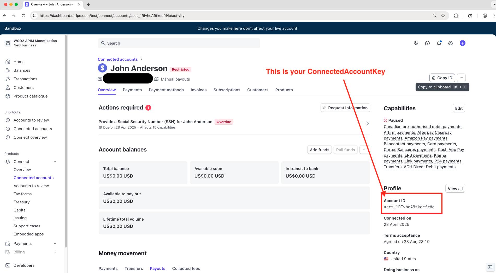

# API Manager Monetization Test Setup (with ELK)

Running a single commmand, if all goes well, should produce the following. 

API Manager with monetized API:


ELK setup with pre-configured dashboards that pull data from the API Manager:


Stripe dashboard that reflect billing as per API usage:


## Before you start
1. Install Rancher (I have only tested on Rancher, others like Docker Desktop may also work. Also, I used Moby container engine, not containerd.). Ideal to allocate about 4-6 cores and 4-8 GB memory in Rancher (Preference > VM).
2. Install docker compose. 
3. Create a Stripe account at https://dashboard.stripe.com/ if you don't have one. You need a couple of keys to connect WSO2 API Manager to Stripe. It's not a big deal, I'll explain:
    - Create a sandbox for testing, Stripe used to call this Test mode until recently.
    - Go to `Developers` on the bottom of the sidebar (or wherever they change it to next) and copy the `Secret key` under API Keys. It should start with sk_test_... This is your **`BillingEnginePlatformKey`**, keep it handy. 
    - Next, go to *Connected accounts* and create one, go for a Standard account type but I think Stripe will change the account types very soon.
    - Put the URL you get into a browser and just enter random data, it's easy. At payouts, choose the Stripe test option (it was somewhere near the bottom I think).
    - Once you are done, if you go back to the *Connected accounts* page, you'll see an account show up. 
    - Go into that account and copy the `Account ID`. This is your **`ConnectedAccountKey`**, keep this handy as well. 
    - That's it. 




<br>

> Just to give you an idea about how API Manager maps to Stripe - 
> - You are the Tenant Admin who runs the API Manager platform, you are responsible for creating the various monetization plans your organization requires.
> - Different API publishers (departments, partners etc.) onboard on to the platform with their details (the random data we input earlier) and get a connected account. They then attach different monetization plans you created to their APIs. 
> - When consumers subscribe to their APIs, the consumer info along with the consumer's subscription is created in the API publisher's connected account. Depending on the consumer's usage, the publisher will invoice them. 

## How to use
```bash
git clone https://github.com/viggnah/wso2-apim-monetization-docker && cd wso2-apim-monetization-docker && chmod +x ./start.sh && ./start.sh
```

**API Manager**
* *Publisher Portal:* https://localhost:9500/publisher/apis
* *Developer Portal:* https://localhost:9500/devportal
* *Admin Portal:* https://localhost:9500/admin/dashboard
* *Username:* `admin`
* *Password:* `admin`

**Kibana Dashboard**

* *URL:* http://localhost:5601/app/dashboards#/view/f954a940-6ed4-11ec-9007-b93f9eb88870
* *Username:* `elastic`
* *Password:* `changeme` 

**Test**
* Go to the devportal (make sure you are signed in) and make some API calls
* The Kibana dashboard will automatically pick it up 
* Go to your terminal and run 
```bash
~/.../wso2-apim-monetization-docker git:(main) ✗  ./apim/publish-monetization-data.sh
```
* The Stripe connected account will get updated

## What this does
1. Spins up an all-in-one API Manager and an ELK (Elasticsearch, Logstash, Kibana) setup. Note that we are using fluentd to forward the logs to Logstash, I just couldn't get filebeat working. 
2. Puts a simple sample API on the API Manager (PizzaShackAPI)
3. Creates a sample monetization plan ($1.10 per API call or something) and attaches it to the API
4. Creates an app on the devportal (SampleMonetizationApp) and subscribes to this API
5. Simulates a bit of traffic by making a few sample calls
6. Pushes out the usage data to Stripe so that the subscription in the Connected account shows the due amount (eg: 5 calls at $1.10 per call - $5.50 is due)

## Wind down
* Go to your terminal and run 
```bash
~/.../wso2-apim-monetization-docker git:(main) ✗  ./stop.sh
```

## Troubleshooting
* If it gets stuck on first execution, stop (ctrl+c) and run it again: `./start.sh`. Sometimes Rancher CPU usage spikes (probably related to https://github.com/rancher-sandbox/rancher-desktop/issues/7087), check this in Activity Monitor (or similar tool - process name will be qemu something). If this is the case, restart Rancher. 

* Sometimes publishing to Stripe fails on start up, in which case, just run the publishing script:  
```bash
~/.../wso2-apim-monetization-docker git:(main) ✗  ./apim/publish-monetization-data.sh
```

* Check logs: `docker compose logs -f`

* Check logs for only one container: `docker logs wso2-apim`, `docker logs -f wso2-apim` (replace *wso2-apim* with desired container name as defined in docker-compose.yml, eg: mysql, logstash, fluentd-agent etc.)

* SSH into container and check stuff inside: `docker exec -it wso2-apim bash`

* For more useful commands and info, refer [this doc](./useful-commands.md). 

## Tested on
Rancher 1.15.1 (Moby engine) on Mac OS Sonoma 14.4.1

